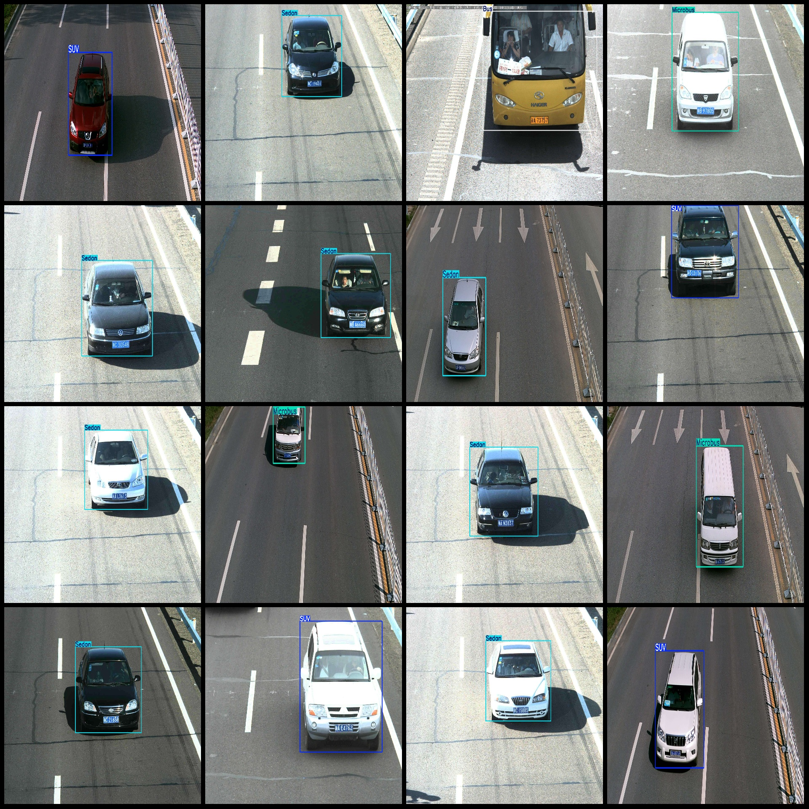
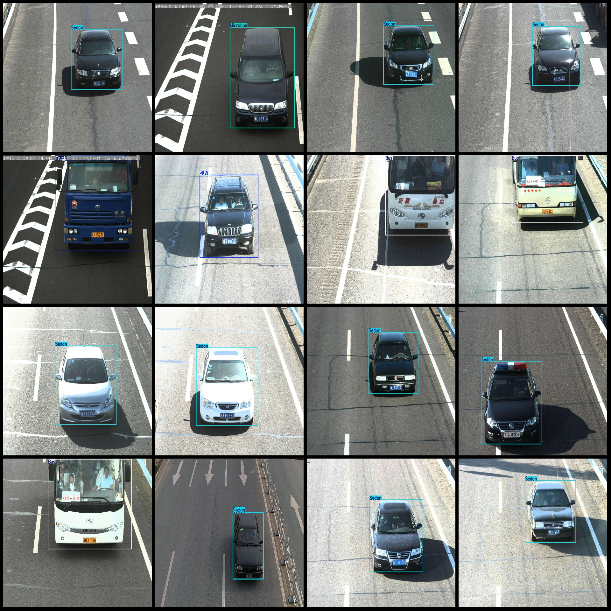

# Vehicle Detection Dataset: BIT-Vehicle
This dataset includes the VOC+YOLO format, totaling 9850 images in Pascal VOC format and 9850 annotations in both XML and TXT files. The format is as follows:

Image Count (in JPG files): 9850
Annotation Count (in XML files): 9850
Annotation Count (in TXT files): 9850
Number of Categories: 6
The categories are labeled according to the labels folder's `classes.txt` file: ["Bus", "Microbus", "Minivan", "SUV", "Sedan", "Truck"]

For each category, the number of bounding boxes is:
- Bus bounding boxes = 558, occupying images = 555
- Microbus bounding boxes = 883, occupying images = 878
- Minivan bounding boxes = 476, occupying images = 474
- SUV bounding boxes = 1392, occupying images = 1381
- Sedan bounding boxes = 5921, occupying images = 5796
- Truck bounding boxes = 823, occupying images = 821
Total bounding boxes: 10053

The image resolution varies, including multiple resolutions such as 1600x1200, 1920x1080, etc.

Annotation tools used include labelImg.
Annotation rules involve drawing bounding boxes for each category.
Please note that this dataset does not have a training/validation/test split; it requires custom partitioning.

Special notice: This dataset does not guarantee any accuracy for models trained on this data or any weight files.

**Note:** For actual usage, you should refer to the labelImg documentation for detailed instructions on how to use it with this dataset.
Image

Here is a pay link on Stripe ( https://buy.stripe.com/3cs8yP7sY87d0vu9AB ). Please contact me lonlonago@foxmail.com after funding $89, and I will send you a complete data files , thank you!

